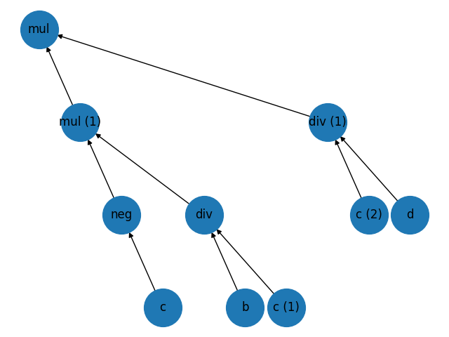

# Genetic-Formula-Generator
Given a problem statement, it can be frequently solved by combining different input features by some logical combinations. Building an extension towards binomial combination of soft and crisp classifiers.

## Target:

(-b)\*(c/d)

## Result:



## Execution:

Code File: `GFG.py`

```py
gfg = GeneticFormulaGenerator(operators=[add, sub, mul, div, neg], operands=[a, b, c, d], target=y, max_genome_sequence=10)
sorted_pop = gfg.search()
best_pop = sorted_pop[0]
root = gfg.make_tree_representation(best_pop, operand_reps=['a', 'b', 'c', 'd'])
gfg.visulaize_tree(root)
```